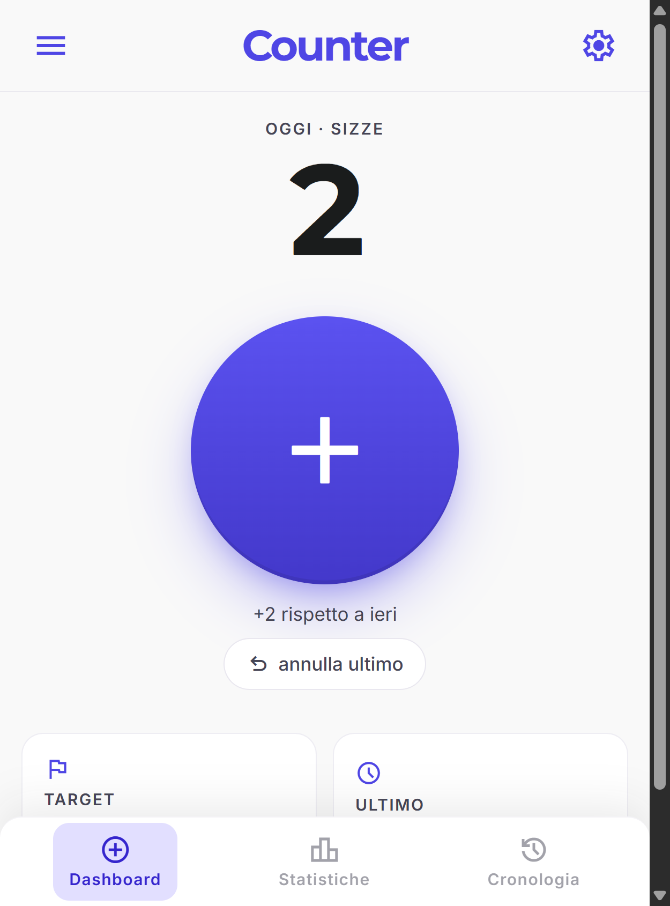
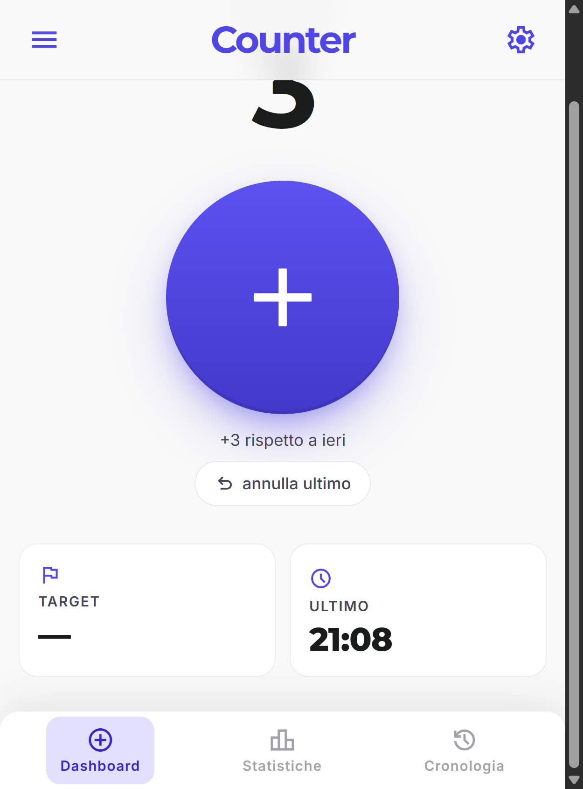
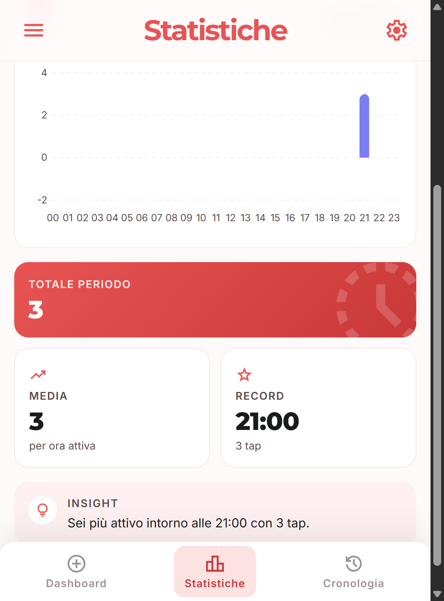

# Counter — Offline-First PWA Tally Counter for Android, iOS & Desktop

**Counter** is a free, open-source **Progressive Web App** to count anything you do during the day:
habits, repetitions, cigarettes, glasses of water, push-ups, intrusive thoughts, coffees, screen unlocks —
whatever you want to track. Multi-counter, fully **offline**, **installable** on Android, iOS and desktop,
with statistics, charts, history and JSON backup. **No account, no tracking, no cloud** — all your data
stays on your device.

> Live demo: **https://www.evemilano.com/cntr/**
> Repository: **https://github.com/evemilano/pwa_counter_app**



---

## Table of contents

- [Why a Counter PWA?](#why-a-counter-pwa)
- [Features](#features)
- [Screenshots](#screenshots)
- [Install the app](#install-the-app)
- [Quickstart for developers](#quickstart-for-developers)
- [Tech stack](#tech-stack)
- [Architecture](#architecture)
- [Data model](#data-model)
- [Backup, import & privacy](#backup-import--privacy)
- [Browser support](#browser-support)
- [Customisation](#customisation)
- [Roadmap](#roadmap)
- [Contributing](#contributing)
- [License](#license)

---

## Why a Counter PWA?

Native Android and iOS counter apps usually come with ads, trackers, account sign-up, or paywalls behind
basic features like multiple counters and charts. **Counter** is a single static folder you can host
anywhere (GitHub Pages, Netlify, any shared hosting) and install on any device that supports modern
web standards — Chrome, Edge, Safari, Firefox, Samsung Internet.

Typical use cases:

- **Habit tracking** — count repetitions of a daily habit and check progress vs a target
- **Tally counter** — quick +1 button to replace mechanical clickers
- **Health & fitness** — water glasses, push-ups, steps, breaks
- **Smoking / vaping reduction** — track cigarettes per day with a daily target trending down
- **Productivity** — pomodoros, deep-work blocks, distractions
- **Anything you'd otherwise track on paper**

---

## Features

- **Multi-counter** — create unlimited counters, each with its own colour and optional **daily target**
- **One-tap increment** — huge accessible button on the dashboard, with haptic feedback on supported devices
- **Undo** — remove the most recent tap of the active counter
- **Statistics with charts** — daily, weekly, monthly and yearly views powered by **ApexCharts**
- **History view** — chronological list of every tap with deletion support
- **Daily target & progress** — set a goal per counter, see how close you are today
- **Offline-first** — works with no connection thanks to a **service worker** with cache-first strategy
- **Installable PWA** — add to home screen on Android & iOS, install as a window on desktop
- **App shortcut** — long-press the home-screen icon for a **Quick +1** to the last used counter
- **Light & dark theme** — automatic, follows OS preference
- **JSON backup & restore** — export and re-import all your data, merge or replace modes
- **No tracking, no analytics, no cloud** — 100% local-first, stored in IndexedDB
- **Zero build step** — pure ES modules, runs from a static folder

---

## Screenshots

| Dashboard | Statistics | Over-target alert |
|---|---|---|
|  |  |  |

---

## Install the app

### Android (Chrome, Edge, Samsung Internet, Brave)

1. Open **https://www.evemilano.com/cntr/** in the browser
2. Tap the **Install** prompt, or open the menu and choose **Install app** / **Add to Home screen**
3. Launch from the home-screen icon — it opens in standalone mode, no browser chrome
4. Long-press the icon to use the **"+1 last counter"** shortcut

### iOS / iPadOS (Safari)

1. Open the URL in **Safari** (Chrome on iOS does not support PWA install)
2. Tap the **Share** button → **Add to Home Screen**
3. Launch from the home screen — runs full-screen, works offline

### Desktop (Chrome, Edge, Brave, Arc)

1. Open the URL
2. Click the install icon in the address bar (or browser menu → **Install Counter**)
3. The app opens in its own window and can be pinned to the taskbar / dock

---

## Quickstart for developers

The app is a **static site** — no build, no Node, no bundler. Anything that serves files over HTTP
will work. A service worker is required for offline mode, and service workers only register on
`http://localhost` or HTTPS — so do **not** open `index.html` with `file://`.

```bash
git clone https://github.com/evemilano/pwa_counter_app.git
cd pwa_counter_app

# any one of these works
python3 -m http.server 8080
# or
npx serve .
# or
php -S localhost:8080
```

Then open `http://localhost:8080`.

### Deploying

Drop the folder on any static host:

- **GitHub Pages** — push to `main`, enable Pages
- **Netlify / Vercel / Cloudflare Pages** — connect the repo, no build command needed
- **Apache / Nginx** — copy the folder, make sure `manifest.webmanifest` is served with
  `application/manifest+json` and `sw.js` is served from the **app root** (scope rules)

---

## Tech stack

- **Vanilla JavaScript (ES modules)** — no framework
- **[Dexie 4](https://dexie.org/)** — IndexedDB wrapper for local storage (loaded via `esm.sh`)
- **[ApexCharts](https://apexcharts.com/)** — charts for the statistics view (loaded via `esm.sh`)
- **[Tailwind CSS](https://tailwindcss.com/)** — utility-first styling via the Play CDN
- **Material Symbols** + **Inter** / **Montserrat** Google Fonts
- **Service Worker** — cache-first with runtime caching for whitelisted CDNs

All third-party dependencies are pinned to specific versions and cached by the service worker after the
first load, so the app keeps working offline.

---

## Architecture

```
cntr/
├── index.html              # App shell, top bar, bottom nav, view containers
├── manifest.webmanifest    # PWA manifest (icons, shortcuts, theme, scope)
├── sw.js                   # Service worker: precache + cache-first strategy
├── css/style.css           # Component styles on top of Tailwind utilities
├── icons/                  # PWA icons (192, 512, maskable, shortcuts)
└── js/
    ├── app.js              # Router, top bar, drawer, shortcut handler, SW registration
    ├── db.js               # Dexie schema, CRUD, date helpers, export/import
    ├── dashboard.js        # Tap-to-count view with daily progress + undo
    ├── stats.js            # ApexCharts daily / weekly / monthly / yearly chart
    ├── history.js          # Chronological tap log with per-row delete
    └── settings.js         # Manage counters, targets, backup/restore, wipe
```

The app uses a simple **router by `data-view`** on the bottom navigation. A custom event bus
(`bus.dispatchEvent("data-changed")`) re-renders the active view whenever data changes.

---

## Data model

Stored locally in **IndexedDB** under the database name `contaapp`.

### `counters`

| field         | type   | description                                       |
|---------------|--------|---------------------------------------------------|
| `id`          | number | auto-increment primary key                        |
| `name`        | string | counter label                                     |
| `color`       | string | hex colour for chart and dot                      |
| `dailyTarget` | number | optional daily goal (0 = no target)               |
| `createdAt`   | number | unix timestamp (ms)                               |

### `taps`

| field        | type   | description                          |
|--------------|--------|--------------------------------------|
| `id`         | number | auto-increment primary key           |
| `counterId`  | number | FK → `counters.id`                   |
| `timestamp`  | number | unix timestamp (ms) when tap occurred |

Compound index on `[counterId+timestamp]` powers all the range queries used by stats and history.

---

## Backup, import & privacy

- **Export** — Settings → Backup → **Export JSON**. Produces a file
  `contaapp-YYYY-MM-DD-HH-MM-SS.json` containing all counters and taps plus a schema version
- **Import** — Settings → Backup → **Import JSON**. Choose between:
  - **Replace** — wipe everything and load from the file
  - **Merge** — keep existing data, append by name, deduplicate taps by `(counterId, timestamp)`
- **Wipe** — Settings → Danger zone → fully clears IndexedDB and `localStorage`

**Privacy by design**: the app never makes a request that would leak your counts. The only network
requests after install are to the precached CDN assets (Tailwind, fonts, Dexie, ApexCharts), and the
service worker serves them from cache after the first run.

---

## Browser support

| Browser              | Install | Offline | Charts | Notes                                 |
|----------------------|:------:|:------:|:------:|---------------------------------------|
| Chrome (Android)     | ✓      | ✓      | ✓      | Full PWA + shortcuts                  |
| Edge / Brave         | ✓      | ✓      | ✓      | Full PWA + shortcuts                  |
| Samsung Internet     | ✓      | ✓      | ✓      | Full PWA                              |
| Safari (iOS 16+)     | ✓      | ✓      | ✓      | "Add to Home Screen", no app shortcuts |
| Firefox (desktop)    | —      | ✓      | ✓      | Runs in tab, no install prompt        |
| Chrome / Edge (desktop) | ✓   | ✓      | ✓      | Install as window                     |

Requires a browser with **IndexedDB**, **Service Workers** and **ES modules** — all evergreen
browsers from 2020 onward.

---

## Customisation

- **Theme colours** — edit `tailwind.config.theme.extend.colors` inside `index.html` and
  `theme_color` / `background_color` in `manifest.webmanifest`
- **App name** — change `name`, `short_name` and `description` in `manifest.webmanifest`,
  the `<title>` in `index.html` and the top-bar title
- **Icons** — replace files in `icons/` keeping the same dimensions (192, 512, maskable 512, shortcut 96)
- **Default palette** — edit the `PALETTE` array at the top of `js/db.js`
- **Cache version** — bump `CACHE` in `sw.js` whenever you ship changes to force update

---

## Roadmap

- [ ] CSV export in addition to JSON
- [ ] Weekly / monthly targets
- [ ] Streaks and best-day badge
- [ ] Per-counter notes on each tap
- [ ] Optional WebDAV / Drive sync (still offline-first)
- [ ] Localisation (currently Italian UI strings)

Open an issue if you want to suggest a feature.

---

## Contributing

Issues and pull requests are welcome. Please:

1. Open an issue first for non-trivial changes
2. Keep the **zero-build** constraint — no bundler, no transpile step
3. Run a quick smoke test with `python3 -m http.server` and DevTools → Application → Service Workers

---

## License

MIT — see [LICENSE](LICENSE) if present, otherwise treat as MIT until specified.

---

## Keywords

`pwa counter` · `tally counter app` · `habit counter` · `offline counter pwa` ·
`installable counter app android` · `multi counter pwa` · `daily target counter` ·
`indexeddb tally app` · `service worker counter` · `apexcharts pwa example` ·
`dexie pwa example` · `vanilla js pwa` · `no-build pwa` · `static pwa counter`
